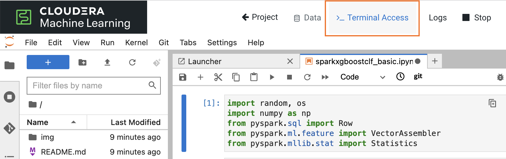
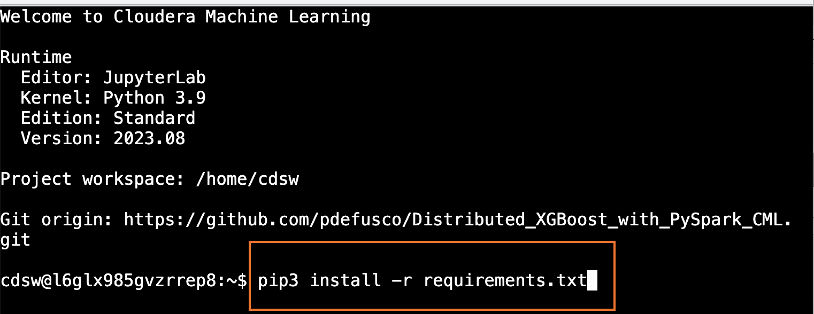
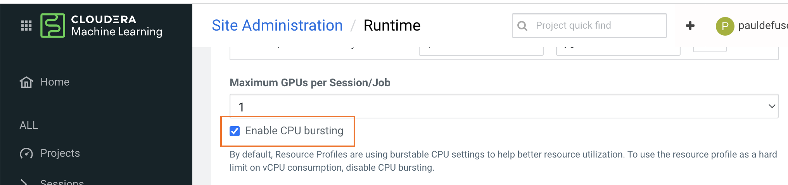
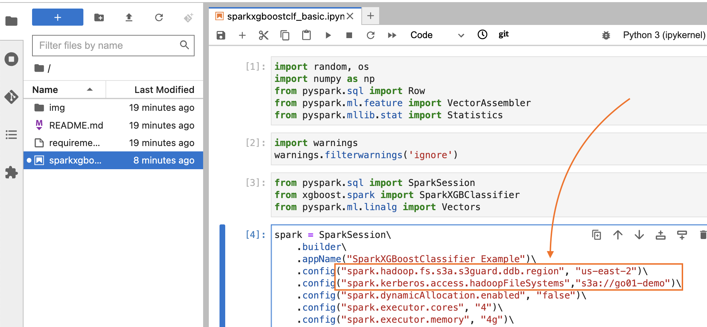
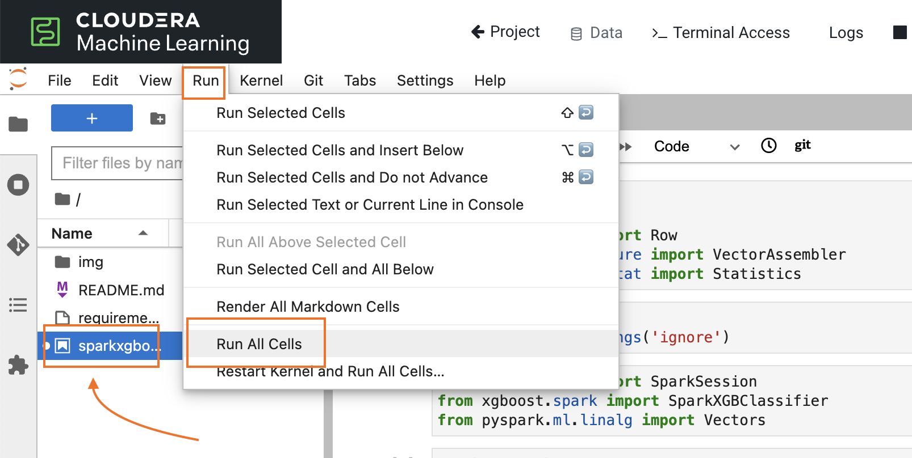

# Distributed XGBoost with PySpark in CML

## Objective

XGBoost stands for Extreme Gradient Boosting and is a scalable, distributed gradient-boosted decision tree (GBDT) machine learning library. It has become a favorite among data scientists in business due to its exceptional performance, ability to handle sparse data and missing values, regularization, parallel computing, and more.

Apache Spark is a powerful open-source engine for big data processing and analytics. Combining XGBoost and Spark can dramatically improve the quality and performance of your Machine Learning models.

This GitHub repository provides notebook examples for using Spark to distribute XGBoost applications in Cloudera Machine Learning.

## About Cloudera Machine Learning

Cloudera Machine Learning (CML) on Cloudera Data Platform accelerates time-to-value by enabling data scientists to collaborate in a single unified platform that is all inclusive for powering any AI use case.

CML is purpose-built for agile experimentation and production ML workflows. It is designed to manage everything from data preparation to MLOps and predictive reporting.

Please visit the [CML Documentation](https://docs.cloudera.com/machine-learning/cloud/product/topics/ml-product-overview.html) for more information.

## Requirements

In order to reproduce this project you need the following:

* A CML Workspace in Private or Public Cloud (AWS, Azure, OCP and Cloudera ECS OK).
* Basic familiarity with Python, Spark, Git and Machine Learning is recommended.
* The code in the notebooks only requires basic modifications. Instructions for these are provided in the "Running the Notebooks" section.
* The CML Workspace does not require a Custom Runtime. The "Standard Runtime" provided in every workspace will be ok.

## Project Setup

Create a CML Project by cloning this Git repository from the CML UI.

Launch a CML Session with the following configurations:

```
Editor: JupyterLab
Kernel: Python 3.8 or above
Edition: Standard
Version: any version ok
Enable Spark: Spark 3.2.0 and above ok
Resource Profile: 2vCPU / 4GiB Memory - 0 GPU
```

Open the Terminal and install the required packages contained in the "requirements.txt" file with the following command:

```
pip3 install -r requirements.txt
```





Navigate to the Workspace "Site Administration" page, open the "Runtime" tab and ensure that the "Enable CPU Bursting" option is enabled.



## Using the Notebook

This part of the tutorial includes three sections:

1. [Set Spark Configurations](https://github.com/pdefusco/Distributed_XGBoost_with_PySpark_CML#set-spark-configurations)
2. [Running All Cells](https://github.com/pdefusco/Distributed_XGBoost_with_PySpark_CML#running-all-cells)
3. [Code Walk-Through](https://github.com/pdefusco/Distributed_XGBoost_with_PySpark_CML#code-walk-through)

#### Set Spark Configurations

Open the ```sparkxgboostclf_basic.ipynb``` notebook. Before running the notebooks you must edit your Spark Session configurations.

On AWS, edit the value of the ```spark.hadoop.fs.s3a.s3guard.ddb.region``` and ```spark.kerberos.access.hadoopFileSystems``` options to reflect your CDP Environment.

On all other platforms, remove the ```spark.hadoop.fs.s3a.s3guard.ddb.region``` from the code and set the ```spark.kerberos.access.hadoopFileSystems``` option only.

The values for both options are available in the CDP Management Console under Environment Configurations. If you have issues finding these please contact your CDP Administrator.   

```
.config("spark.hadoop.fs.s3a.s3guard.ddb.region", "us-east-2")\
.config("spark.kerberos.access.hadoopFileSystems", "s3a://go01-demo")\
```



#### Running All Cells

No other edits are required. The JupyterLab Editor provides an intuitive way to run all cells. Select "Run" -> "Run All Cells" from the top bar menu.



#### Code Walk-Through

This section will highlight the most important code in the notebook.

* Cell 1: The "SparkXGBClassifier" class is imported from the "xgboost.spark" module. XGBoost also provides a "SparkXGBRegressor" class for Regression tasks.

```
from pyspark.sql import SparkSession
from xgboost.spark import SparkXGBClassifier
from pyspark.ml.linalg import Vectors
```

* Cell 2: The SparkSession object is created. The "xgboost.spark" module requires disabling Spark Dynamic Allocation. Therefore we set four Executors with basic Memory and Core configurations.

```
spark = SparkSession\
    .builder\
    .appName("SparkXGBoostClassifier Example")\
    .config("spark.hadoop.fs.s3a.s3guard.ddb.region", "us-east-2")\
    .config("spark.kerberos.access.hadoopFileSystems","s3a://go01-demo")\
    .config("spark.dynamicAllocation.enabled", "false")\
    .config("spark.executor.cores", "4")\
    .config("spark.executor.memory", "4g")\
    .config("spark.executor.instances", "4")\
    .config("spark.driver.core","4")\
    .config("spark.driver.memory","4g")\
    .getOrCreate()
```

* Cell 3: The code to reach the Spark UI in CML. Uncomment and run the cell and open the URL provided in the output to follow along in the Spark UI.

```
import os
print("https://spark-"+os.environ["CDSW_ENGINE_ID"]+"."+os.environ["CDSW_DOMAIN"])
```

* Cell 4 and 6: Two basic Spark Dataframes are created as training and test data.

```
df_train = spark.createDataFrame([
    (Vectors.dense(1.0, 2.0, 3.0), 0, False, 1.0),
    (Vectors.sparse(3, {1: 1.0, 2: 5.5}), 1, False, 2.0),
    (Vectors.dense(4.0, 5.0, 6.0), 0, True, 1.0),
    (Vectors.sparse(3, {1: 6.0, 2: 7.5}), 1, True, 2.0),
], ["features", "label", "isVal", "weight"])

df_test = spark.createDataFrame([
    (Vectors.dense(1.0, 2.0, 3.0), ),
], ["features"])
```

* Cell 7: an object of the "SparkXGBClassifier" class is instantiated with default hyperparameters. Notice the "num_workers" option is set to 2. This value should be set to the number of Executors you want to distribute your SparkXGBoost Application across.

```
xgb_classifier = SparkXGBClassifier(max_depth=5, missing=0.0,
    validation_indicator_col='isVal', weight_col='weight',
    early_stopping_rounds=1, eval_metric='logloss', num_workers=2)
```

* Cell 8: the classifier is trained on the training data.

```
xgb_clf_model = xgb_classifier.fit(df_train)
```

* Cell 9: the classifier is used to run inference on the test data.

```
xgb_clf_model.transform(df_test).show()
```

Classifier Sample Prediction on Test Data:

```
+-------------+-------------+----------+-----------+
|     features|rawPrediction|prediction|probability|
+-------------+-------------+----------+-----------+
|[1.0,2.0,3.0]|   [-0.0,0.0]|       0.0|  [0.5,0.5]|
+-------------+-------------+----------+-----------+
```

## Summary and Next Steps

This basic example provided a Quickstart for Distributed XGBoost with PySpark in Cloudera Machine Learning.

Integrating XGBoost and Spark provides data scientists with the opportunity to leverage the strengths of both. XGBoost is used to achieve high model performance. Spark is used to distribute advanced Machine Learning algorithms across large clusters of worker nodes.

If you use CML you may also benefit from the following projects:

* [Telco Churn Demo](https://github.com/pdefusco/CML_AMP_Churn_Prediction): Build an End to End ML Project in CML and Increase ML Explainability with the LIME Library
* [Learn how to use Cloudera Applied ML Prototypes](https://docs.cloudera.com/machine-learning/cloud/applied-ml-prototypes/topics/ml-amps-overview.html) to discover more projects using MLFlow, Streamlit, Tensorflow, PyTorch and many more popular libraries
* [CSA2CML](https://github.com/pdefusco/CSA2CML): Build a real time anomaly detection dashboard with Flink, CML, and Streamlit
* [SDX2CDE](https://github.com/pdefusco/SDX2CDE): Explore ML Governance and Security features in SDX to increase legal compliance and enhance ML Ops best practices
* [API v2](https://github.com/pdefusco/CML_AMP_APIv2): Familiarize yourself with API v2, CML's goto Python Library for ML Ops and DevOps
* [MLOps](https://github.com/pdefusco/MLOps): Explore a detailed ML Ops pipeline powered by Apache Iceberg
